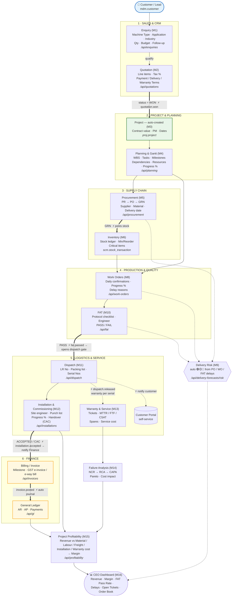

# Boss Engineers ERP — End-to-End Client Workflow

How a single order flows through the system, from first customer enquiry to final
profitability — with the real modules, screens/APIs, statuses, and the **automatic
cross-module triggers** (⚡) that fire without anyone re-keying data.

> **Worked example used throughout:** *Mahindra & Mahindra* enquires for **one
> Medium-Frequency Vertical Scanner** to **harden tractor axle shafts** (Automotive).

---

## The flow

**Legend** — `==>` thick arrow = a stage hand-off; **⚡** = an *automatic* trigger
(the system creates the next record / notification with no re-keying); `-.->` dotted
= a side-effect (warranty, notification, risk signal). `🟢🟡🔴` = live delivery-risk.

---

## The same journey, step by step (Mahindra axle-shaft hardener)

| # | Stage | Who (role) | Screen / API | What is entered | What the system does |
|---|-------|-----------|--------------|-----------------|----------------------|
| 1 | **Enquiry** | Sales Exec | Enquiries → New | Customer *Mahindra*, Machine Type *Vertical Scanner*, Application *Hardening*, Industry *Automotive*, Qty *1*, Budget *₹38 L*, Follow-up date | Generates `ENQ/…`, status **NEW** |
| 2 | **Quotation** | Sales | Quotations → New (from enquiry) | Line: *MF Vertical Scanner 100 kW* + tooling; Tax *18% GST*; Payment *30% adv + 60% pre-dispatch + 10% post-commissioning*; Warranty *12 mo from commissioning* | `QTN/…`; on **Send** ⚡ emails the PDF; on **WON** ⚡ `quotation.won` |
| 3 | **Project** | *(automatic)* | Projects | — | ⚡ **Auto-creates** `PRJ/…` with the contract value, links the quotation. PM assigned |
| 4 | **Planning** | Project Manager | Planning | WBS (design→fab→assembly→test), milestones, task dependencies, resource allocation (% complete) | Gantt + baseline; feeds Workload + Delivery Risk |
| 5 | **Procurement** | Purchase | Purchase Requisitions → POs → Goods Receipts | PR for copper coil, SCR/IGBT stack, transformer; PO to supplier; GRN on arrival | On **GRN** ⚡ **posts a stock movement** (`scm.stock_transaction`) |
| 6 | **Inventory** | Stores | Stock · Critical Items | — | On-hand updated; below Min/Reorder flags a **Critical Item** (shows on dashboard) |
| 7 | **Production** | Production | Work Orders | Daily confirmations (qty done, hours), **progress %**, any **delay reason** | WIP tracked; late WOs raise the **Delivery Risk** to 🟡/🔴 |
| 8 | **FAT** | QC Engineer | FAT | Protocol checklist results, witnessing engineer, **PASS** | On **PASS** ⚡ `fat.passed` **opens the dispatch quality gate** |
| 9 | **Dispatch** | Logistics | Dispatch | LR number, packing list, **serial numbers** | On **RELEASE** ⚡ `dispatch.released` → (a) **starts a 12-mo warranty per serial**, (b) **notifies the customer** on the portal |
| 10 | **Installation** | Service Engineer | Installations | Site engineer, punch-list items, **progress %**, Customer Acceptance Cert (CAC) | On **ACCEPTED** ⚡ `installation.accepted` **notifies Finance to raise final billing** |
| 11 | **Billing** | Finance | Invoices | Milestone invoice, GST **e-invoice / e-way bill** | On **post** ⚡ **auto-posts a balanced GL journal**; payment receipt ⚡ GL too |
| 12 | **Service** | Service | Service Tickets | Complaint, field visits, spares, resolution | Computes **MTTR / First-Time-Fix / CSAT / service cost** |
| 13 | **Failure** | QC | NCR / CAPA | Failure mode, root cause, **cost impact** | **Pareto** of failures by frequency + cost |
| 14 | **Profitability** | Finance / CEO | Profitability | — | Revenue (invoiced) **vs cost by category** (Material/Labour/Freight/Installation/Warranty) → **Margin %** |
| 15 | **Dashboard** | CEO / Mgmt | Dashboard | — | Live KPIs: Revenue, Avg Margin, **FAT Pass Rate**, **Production Efficiency**, Delivery-at-Risk, Open Tickets, Order Book |

---

## What makes it a *system* (not 16 separate screens)

- **5 automatic hand-offs** remove re-keying and enforce the lifecycle:
  `quotation.won → Project` · `fat.passed → Dispatch gate` · `dispatch.released → Warranty + Customer notice` · `installation.accepted → Finance` · `invoice/payment → General Ledger`.
- **Live Delivery Risk** (🟢🟡🔴) is computed on demand from real overdue POs, delayed
  work orders, and pending/failed FATs — not hand-entered.
- **Central Search** ties the whole journey together: type the customer name or **any**
  document number (Enquiry / Quote / Project / **Machine Serial No** / Service Ticket)
  to jump across every stage of that one order.
- **Least-privilege roles**: each step is gated to the right role (Sales, Purchase,
  Stores, Production, QC, Logistics, Service, Finance, CEO) — deny-by-default RBAC,
  with a full append-only audit trail and per-company data isolation (RLS).

---

*Rendered automatically by GitHub / any Mermaid viewer. To export an image, open this
file in VS Code (Mermaid preview) or paste the diagram into <https://mermaid.live>.*
