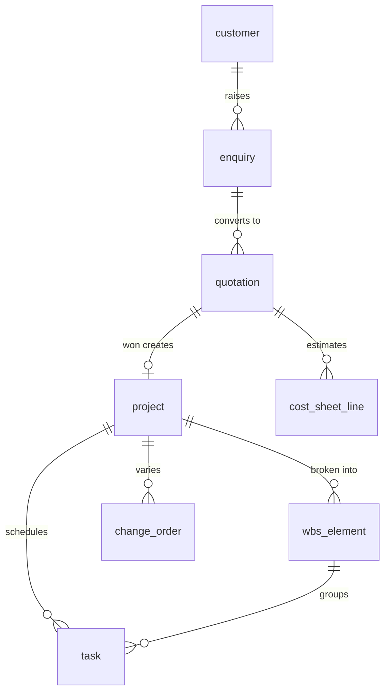
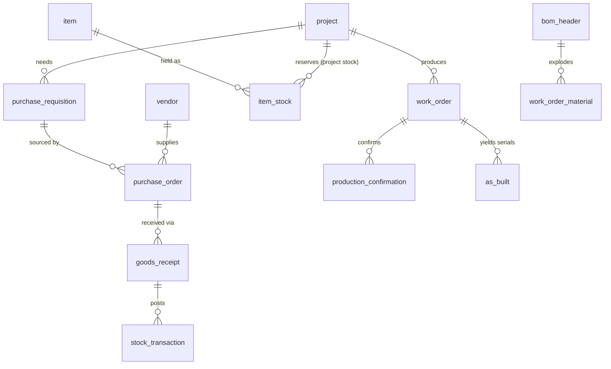
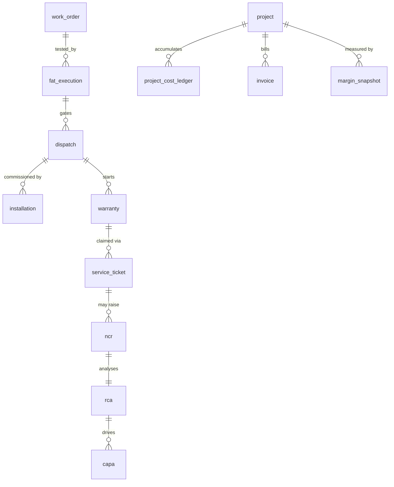

# Database Design Document (DDD)
## Boss Engineers ERP — Enterprise Schema

| Field | Detail |
|---|---|
| Document ID | BE-ERP-DDD-001 |
| Version | 1.0 |
| Date | 2026-06-06 |
| Target RDBMS | PostgreSQL 15+ (portable to SQL Server 2019+/Oracle 19c+) |
| Source | BE-ERP-FRD-001 (FRD v1.0) |
| Classification | Confidential — Internal |
| Executable DDL | `db/00_run_all.sql` (+ `db/01..06_*.sql`) — ~120 tables |

> This document is the logical/physical design narrative. The **buildable schema** lives in `db/` as six ordered SQL files; run `db/00_run_all.sql` to create everything.

---

## 1. Database Architecture

### 1.1 Topology
- **OLTP primary** (read/write) + **2 streaming read replicas** (reporting/dashboard offload).
- **OLAP/reporting**: micro-batch ETL into `rpt` star schema and **materialized views** for the CEO dashboard (M16). Never run dashboards on the OLTP primary.
- **Connection pooling**: PgBouncer (transaction mode).
- **Caching**: Redis for session, RBAC resolution, hot reference data.
- **HA**: 1 synchronous standby (zero-data-loss failover) + async replicas.

### 1.2 Schema Namespaces
| Schema | Domain | FRD Modules |
|---|---|---|
| `sec` | Security, RBAC, approval engine | cross-cutting |
| `mdm` | Master data (incl. BOM, GL accounts) | foundation + gaps |
| `sales` | Enquiry, Quotation, CRM | M01, M02 |
| `proj` | Project, WBS, Planning/Gantt, Change Orders, Delivery Prediction | M03, M04, M09 |
| `scm` | Procurement, Inventory, Critical Items, Subcontract | M05, M06 |
| `hcm` | Employee, capacity, timesheets | M07 |
| `mfg` | Production, work orders, as-built | M08 |
| `qms` | FAT, inspection, NCR, RCA, CAPA | M10, M14 |
| `log` | Dispatch, shipment, e-way bill | M11 |
| `svc` | Installation/SAT, Warranty, Service, AMC | M12, M13 |
| `fin` | Billing/Invoicing, Tax, Cost Ledger, Profitability | M15 + gaps |
| `audit` | Change/login/approval audit (partitioned) | cross-cutting |
| `rpt` | Star schema + materialized views | M16 |

### 1.3 Modeling Conventions
- **Naming**: `snake_case`, singular table names, schema-qualified. Human document numbers (`PRJ-2026-000123`) stored separately from surrogate keys.
- **PK**: `BIGINT GENERATED ALWAYS AS IDENTITY` (sequential surrogate; best join/index performance).
- **Business key**: separate `*_no/*_code VARCHAR UNIQUE`.
- **Money/qty**: `NUMERIC(20,4)` amounts, `NUMERIC(20,6)` unit rates, `NUMERIC(9,4)` percentages. Never `FLOAT` for money.
- **Time**: `TIMESTAMPTZ` (UTC); `DATE` for business dates.
- **Concurrency**: `row_version INT` (optimistic locking).
- **Soft delete**: `is_deleted BOOLEAN`; partial indexes filter `WHERE is_deleted = false`.
- **Multi-company**: `company_id` on business tables (tenant/legal-entity isolation; enables RLS).
- **Status**: `VARCHAR` + `CHECK` enum; configurable statuses can migrate to `mdm.status_master`.
- **Every FK is indexed** (PostgreSQL does not auto-index FKs).

### 1.4 Standard Column Sets
- **`+STD_ORG`** → `company_id BIGINT NOT NULL REFERENCES mdm.company`.
- **`+STD_AUDIT`** → `created_at, created_by, updated_at, updated_by, row_version, is_deleted` (created/updated_by FK `sec.app_user`).

---

## 2. Master Tables (`mdm`, `sec`)
Security/RBAC: `app_user, role, permission, user_role, role_permission, delegation_of_authority, approval_request, approval_action` (one generic approval engine drives all document approvals A1–A17).

Master data: `company, business_unit, warehouse, storage_bin, currency, exchange_rate, uom, uom_conversion, item_category, hsn_sac, tax_code, payment_term, incoterm, gl_account, cost_center, work_center, routing, routing_operation, numbering_series, reason_code, status_master, customer (+contact/+address), vendor (+contact/+address/+rating), item, bom_header, bom_line`.

Key tables with full column/constraint/FK/index specs are defined in `db/01_security_master.sql`. Highlights:
- **`mdm.item`** — most-referenced table; flags `is_critical/is_serialized/is_batch_tracked`, `valuation_method`, trigram index on name.
- **`mdm.bom_header/bom_line`** — EBOM/MBOM (FRD gap-fill; load-bearing for procurement & production).
- **`mdm.gl_account`** — chart of accounts (finance foundation).

---

## 3. Transaction Tables
By module (full DDL in `db/02..05`):
- **Sales** (`02`): `enquiry (+line/+attachment)`, `quotation (+revision/+line)`, `cost_sheet (+line)` → cost sheet becomes project budget on WON.
- **Project** (`02`): `project` (the spine), `wbs_element`, `milestone`, `project_team`, `task (+dependency/+resource)`, `baseline`, `change_order`, `delivery_forecast`.
- **Supply chain** (`03`): `purchase_requisition (+line)`, `rfq (+vendor/+quote/+line)`, `purchase_order (+line/+amendment)`, `goods_receipt (+line)`, `item_stock`, `stock_transaction` (partitioned ledger), `material_reservation/issue`, `critical_item (+alert)`, `subcontract_*`, `stock_count`, `batch_lot`, `serial_number`.
- **HCM** (`03`): `employee`, `skill`, `capacity_calendar`, `leave`, `resource_allocation`, `timesheet (+line)` → actual labour cost to M15.
- **Production** (`03`): `work_order (+operation/+material)`, `production_confirmation`, `as_built` (serial genealogy).
- **Quality** (`04`): `fat_protocol (+param)`, `fat_execution (+result_line)`, `punch_item`, `inspection (+line)`, `ncr → rca → capa (+action)`, `failure_mode`.
- **Logistics** (`04`): `dispatch (+line)`, `packing_list (+item)` — gated by FAT + payment; sets warranty start.
- **Service** (`04`): `installation` (SAT/CAC), `warranty`, `service_contract (+sla)`, `service_ticket (+field_visit/+spare_issue)`, `warranty_claim`.
- **Finance** (`05`): `invoice (+line)`, `payment_receipt (+allocation)`, `vendor_invoice (+line)/vendor_payment`, `gl_entry (+line)` (partitioned), **`project_cost_ledger`** (partitioned — heart of M15: BUDGET vs COMMITTED vs ACTUAL), `revenue_recognition`, `margin_snapshot`, `tax_transaction`, `advance`, `retention`.

---

## 4. Audit Tables (`audit`)
`audit_log` (field-level, JSONB old/new, partitioned monthly), `login_audit` (partitioned), `doc_status_history`, `integration_log` (e-invoice/e-way API calls, partitioned). **Append-only** (no UPDATE/DELETE grants); populated by `AFTER` row triggers (`audit.fn_audit`, `audit.fn_status_history` in `db/06`).

---

## 5. Reporting Tables (`rpt`)
Star schema: dims `dim_date, dim_project, dim_customer, dim_vendor, dim_item, dim_employee` (Type-2 where needed); facts `fact_project_financials, fact_sales_funnel, fact_procurement, fact_production, fact_inventory, fact_service`. CEO dashboard materialized views: `mv_ceo_portfolio`, `mv_project_health_heatmap`, `mv_at_risk_projects` (refresh `CONCURRENTLY` every 5–15 min).

---

## 6. Relationship Diagrams

**Cluster A — Quote-to-Project spine**

**Cluster B — Supply & Make**

**Cluster C — Prove, Deliver, Serve, Cost**

`proj.project` is the universal cost collector (~25 transaction tables reference it). `mdm.item` and `mdm.customer` are the master-data fan-out hubs.

---

## 7. Indexing Strategy
1. PK on every table; **every FK column indexed** (un-indexed FKs cause lock escalation).
2. Unique business keys (`*_no/*_code`).
3. Composite **status+date** indexes with equality columns first (e.g. `purchase_order(status, po_date)`).
4. **Partial indexes** for hot subsets: `WHERE is_deleted=false`, active-project due dates, open SLA tickets, open critical items.
5. **Covering/INCLUDE** indexes on dashboard hot paths.
6. **GIN/trigram** (`pg_trgm`) on `item.item_name`, `customer/vendor.name`; GIN on JSONB (`audit_log.new_values`).
7. **BRIN** on append-only time-ordered partitioned tables (`stock_transaction`, `project_cost_ledger`, `audit_log`).
8. Avoid redundant indexes already covered by a composite's leading column; review with `pg_stat_user_indexes`.

---

## 8. Performance Strategy
- OLTP/OLAP split; reporting on replicas + `rpt` star schema.
- Materialized views for the CEO dashboard (refresh `CONCURRENTLY`).
- PgBouncer pooling; Redis caching for RBAC + reference data.
- **Keyset pagination** instead of `OFFSET` on large lists.
- Set-based ledger postings (no N+1).
- Autovacuum tuning + `fillfactor 80–90` on hot-updated tables to enable HOT updates.
- Raise `default_statistics_target` on skewed FK columns (`project_id`, `item_id`).
- Generated columns (`qty_available`, `margin_pct`) computed in-DB.
- Archive closed-project data to keep the working set small.
- `pg_stat_statements` + mandatory `EXPLAIN (ANALYZE, BUFFERS)` for queries > 100 ms.
- Targets: OLTP txn < 1 s; dashboard tiles < 3 s (from MV); search < 500 ms.

---

## 9. Partitioning Strategy (PostgreSQL declarative)
| Table | Method | Key | Granularity | Retention |
|---|---|---|---|---|
| `audit.audit_log` | RANGE | event_time | Monthly | 13 mo online, 8 yr archive |
| `audit.login_audit` / `integration_log` | RANGE | ts | Monthly | 12–24 mo |
| `scm.stock_transaction` | RANGE | txn_date | Monthly → yearly | 24 mo online |
| `fin.project_cost_ledger` | RANGE | posting_date | Fiscal-period | 8 yr statutory |
| `fin.gl_entry` | RANGE | posting_date | Fiscal-period | 8 yr statutory |

Principles: always filter on the partition key (pruning); rolling-window automation via `public.ensure_month_partition()` / `pg_partman`; DEFAULT partition catches strays; local indexes + BRIN on time key; boundaries aligned to fiscal periods (FY starts April). Optional LIST subpartition by `company_id` for large multi-tenant entities.

---

## 10. Backup & Recovery Strategy
**Objectives:** RPO ≤ 5 min, RTO ≤ 1 hr; statutory retention 8 years.

| Layer | Mechanism | Frequency | Retention |
|---|---|---|---|
| PITR (physical) | pgBackRest/WAL-G: full + incr + continuous WAL | Full weekly, incr daily, WAL continuous | 35-day PITR |
| Logical | `pg_dump` per schema | Nightly | 14 days |
| HA standby | Synchronous streaming replica (Patroni) | Continuous | live |
| Read replicas | Async streaming | Continuous | live |
| Archive (statutory) | Monthly logical export + detached cold partitions → WORM object storage | Monthly | 8 years |
| Offsite/DR | Cross-region backup replication | Continuous/daily | mirrors |

Controls: AES-256 encryption + TLS; WORM/object-lock on statutory archives; **monthly automated restore drills** + quarterly DR failover; alerting on WAL/replica lag and failed backups; PITR to the second before an erroneous bulk posting.

---

## Appendix A — File Map
| File | Contents |
|---|---|
| `db/00_run_all.sql` | Master run script (`\ir` includes in order) |
| `db/01_security_master.sql` | Extensions, schemas, `sec`, `mdm` (incl. BOM/GL) |
| `db/02_sales_project.sql` | `sales`, `proj` |
| `db/03_hcm_mfg_scm.sql` | `hcm`, `mfg`, `scm` (partitioned `stock_transaction`) |
| `db/04_qms_log_svc.sql` | `qms`, `log`, `svc` |
| `db/05_fin_audit_rpt.sql` | `fin` (partitioned cost ledger), `audit`, `rpt` |
| `db/06_constraints_automation.sql` | Deferred FKs, partition automation, audit/status triggers, seed, roles, dashboard MVs |

## Appendix B — Conventions Quick-Reference
Surrogate BIGINT identity PKs · separate human `*_no` · NUMERIC money · TIMESTAMPTZ/UTC · `+STD_AUDIT` + `+STD_ORG` · soft-delete + partial indexes · optimistic `row_version` · trigger-based immutable audit · all FKs indexed · `ON DELETE` mostly `RESTRICT` (CASCADE only for true child lines).

## Appendix C — Table Count
Master ~30 · Transaction ~70 · Audit ~5 (partitioned) · Reporting ~12 (dims+facts) + 3 materialized views ≈ **120 tables**.
